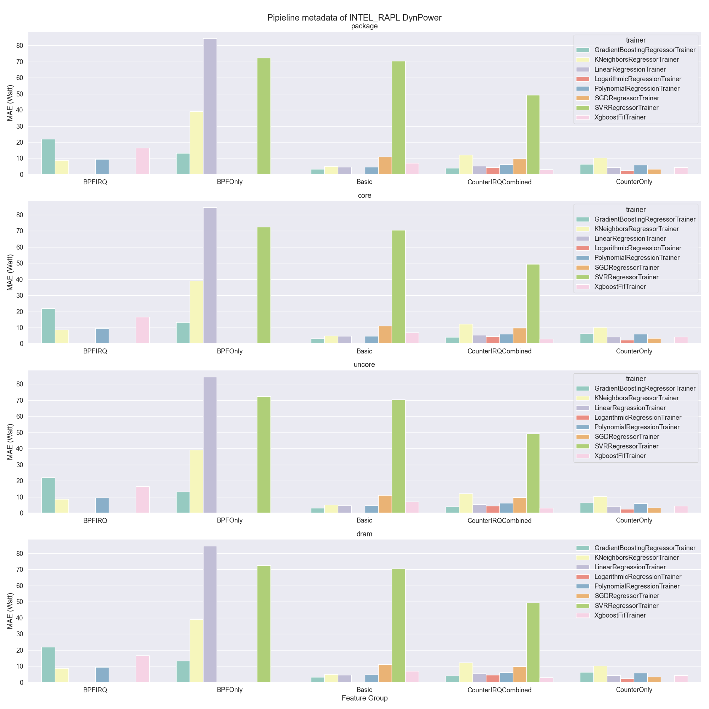

# ec2 on v0.7 Build

MAE Threshold = 10, MAPE Threshold = 20%

Available Node Type: 5

| node type | processor | cores | chips | memory | frequency | member size | error report |
| --- | --- | --- | --- | --- | --- | --- | --- |
| 0 | m5zn.metal | 48 | 2 | -1 | -1 | 1 | [link](./error_report/node_type_0.md) |
| 1 | c5d.metal | 96 | 2 | -1 | -1 | 1 | [link](./error_report/node_type_1.md) |
| 2 | i3en.metal | 96 | 2 | -1 | -1 | 1 | [link](./error_report/node_type_2.md) |
| 3 | m7i.metal-24xl | 96 | 2 | -1 | -1 | 1 | [link](./error_report/node_type_3.md) |
| 4 | i3.metal | 72 | 2 | -1 | -1 | 1 | [link](./error_report/node_type_4.md) |
## intel_rapl (AbsPower)

## intel_rapl (DynPower)

