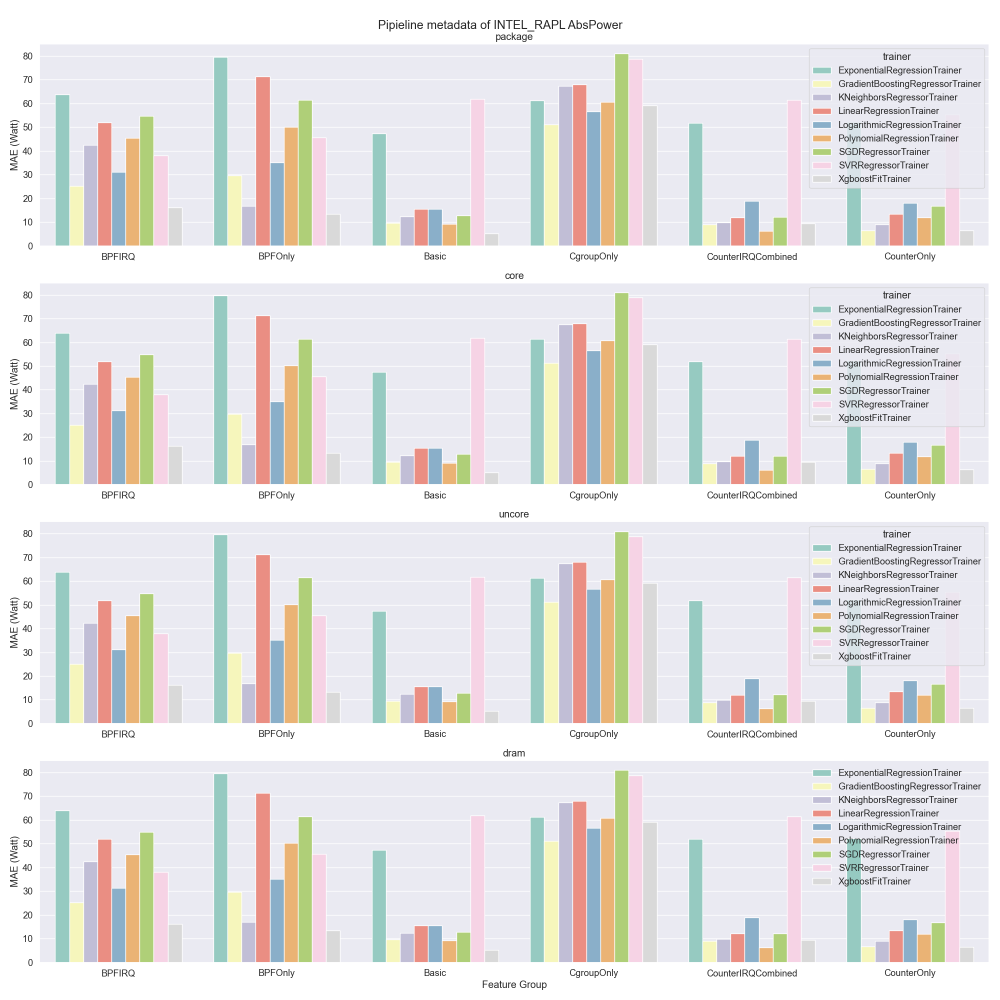

# ec2 on v0.7 Build

MAE Threshold = 10, MAPE Threshold = 20%

Available Node Type: 4

| node type | processor | cores | chips | memory | frequency | member size | error report |
| --- | --- | --- | --- | --- | --- | --- | --- |
| 0 | intel_xeon_platinum_8252c | 48 | 2 | 188 | 4500 | 1 | [link](./error_report/node_type_0.md) |
| 1 | intel_xeon_e5_2686v4 | 72 | 2 | 503 | 3000 | 1 | [link](./error_report/node_type_1.md) |
| 2 | intel_xeon_platinum_8275cl | 96 | 2 | 188 | 3900 | 1 | [link](./error_report/node_type_2.md) |
| 3 | intel_xeon_platinum_8259cl | 96 | 2 | 377 | 3500 | 1 | [link](./error_report/node_type_3.md) |
