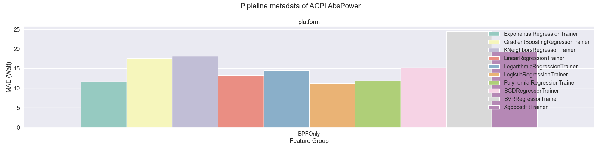
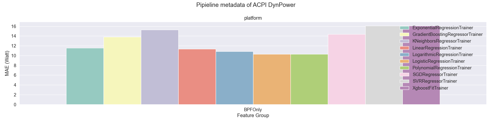
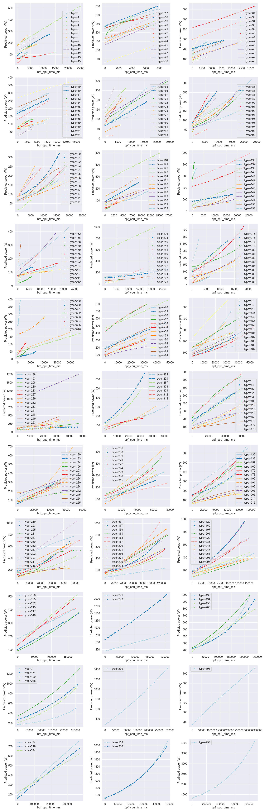
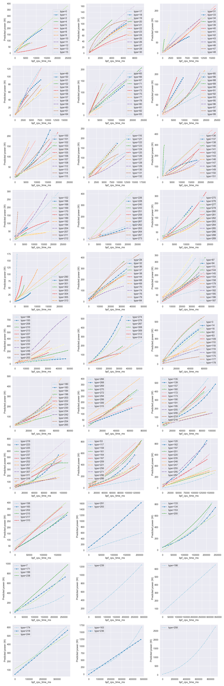

# specpower-0.7.11 on v0.7.11 Build

MAE Threshold = 10, MAPE Threshold = 20%

Available Node Type: 317

| node type | processor | cores | chips | memory | frequency | member size | error report |
| --- | --- | --- | --- | --- | --- | --- | --- |
| 0 | intel_xeon_x3360 | 4.0 | 1.0 | 4.0 | 2800.0 | 8 | [link](./error_report/node_type_0.md) |
| 1 | amd_opteron_6174 | 24.0 | 2.0 | 16.0 | 2200.0 | 5 | [link](./error_report/node_type_1.md) |
| 2 | amd_opteron_6174 | 48.0 | 4.0 | 32.0 | 2200.0 | 3 | [link](./error_report/node_type_2.md) |
| 3 | amd_opteron_6278 | 64.0 | 4.0 | 64.0 | 2400.0 | 2 | [link](./error_report/node_type_3.md) |
| 4 | intel_xeon_l5410 | 8.0 | 2.0 | 8.0 | 2300.0 | 1 | [link](./error_report/node_type_4.md) |
| 5 | intel_xeon_x3430 | 4.0 | 1.0 | 4.0 | 2400.0 | 1 | [link](./error_report/node_type_5.md) |
| 6 | ampere_altra_q64_30 | 64.0 | 1.0 | 32.0 | 3000.0 | 1 | [link](./error_report/node_type_6.md) |
| 7 | ampere_altra_max_m128_30 | 256.0 | 2.0 | 256.0 | 3000.0 | 2 | [link](./error_report/node_type_7.md) |
| 8 | intel_xeon_l5420 | 8.0 | 2.0 | 8.0 | 2500.0 | 6 | [link](./error_report/node_type_8.md) |
| 9 | xeon_l5420 | 4.0 | 2.0 | 16.0 | 2500.0 | 1 | [link](./error_report/node_type_9.md) |
| 10 | intel_xeon_l5430 | 8.0 | 2.0 | 16.0 | 2700.0 | 1 | [link](./error_report/node_type_10.md) |
| 11 | intel_xeon_l5430 | 8.0 | 2.0 | 8.0 | 2700.0 | 13 | [link](./error_report/node_type_11.md) |
| 12 | intel_xeon_l3360 | 4.0 | 1.0 | 8.0 | 2800.0 | 1 | [link](./error_report/node_type_12.md) |
| 13 | intel_xeon_l3360 | 4.0 | 1.0 | 4.0 | 2800.0 | 6 | [link](./error_report/node_type_13.md) |
| 14 | amd_opteron_6276 | 64.0 | 4.0 | 64.0 | 2300.0 | 3 | [link](./error_report/node_type_14.md) |
| 15 | intel_xeon_l5410 | 4.0 | 1.0 | 8.0 | 2300.0 | 1 | [link](./error_report/node_type_15.md) |
| 16 | amd_opteron_6380 | 64.0 | 4.0 | 64.0 | 2500.0 | 3 | [link](./error_report/node_type_16.md) |
| 17 | intel_xeon_e5345 | 8.0 | 2.0 | 16.0 | 2300.0 | 1 | [link](./error_report/node_type_17.md) |
| 18 | intel_xeon_e5345 | 8.0 | 2.0 | 8.0 | 2300.0 | 2 | [link](./error_report/node_type_18.md) |
| 19 | intel_xeon_5160 | 4.0 | 2.0 | 8.0 | 3000.0 | 3 | [link](./error_report/node_type_19.md) |
| 20 | amd_opteron_2216he | 4.0 | 2.0 | 16.0 | 2400.0 | 1 | [link](./error_report/node_type_20.md) |
| 21 | intel_xeon_l5408 | 8.0 | 2.0 | 8.0 | 2100.0 | 1 | [link](./error_report/node_type_21.md) |
| 22 | intel_xeon_l5408 | 8.0 | 2.0 | 32.0 | 2100.0 | 2 | [link](./error_report/node_type_22.md) |
| 23 | intel_xeon_e5440 | 8.0 | 2.0 | 8.0 | 2800.0 | 1 | [link](./error_report/node_type_23.md) |
| 24 | intel_xeon_e5440 | 8.0 | 2.0 | 16.0 | 2800.0 | 3 | [link](./error_report/node_type_24.md) |
| 25 | amd_opteron_2356 | 8.0 | 2.0 | 16.0 | 2300.0 | 1 | [link](./error_report/node_type_25.md) |
| 26 | amd_opteron_2382 | 8.0 | 2.0 | 16.0 | 2600.0 | 1 | [link](./error_report/node_type_26.md) |
| 27 | amd_opteron_4376he | 16.0 | 2.0 | 16.0 | 2600.0 | 1 | [link](./error_report/node_type_27.md) |
| 28 | amd_opteron_6276 | 32.0 | 2.0 | 32.0 | 2300.0 | 4 | [link](./error_report/node_type_28.md) |
| 29 | intel_xeon_e5472 | 8.0 | 2.0 | 16.0 | 3000.0 | 3 | [link](./error_report/node_type_29.md) |
| 30 | intel_xeon_e5420 | 8.0 | 2.0 | 16.0 | 2500.0 | 1 | [link](./error_report/node_type_30.md) |
| 31 | intel_xeon_x5272 | 4.0 | 2.0 | 8.0 | 3400.0 | 1 | [link](./error_report/node_type_31.md) |
| 32 | amd_opteron_6176 | 48.0 | 4.0 | 32.0 | 2300.0 | 2 | [link](./error_report/node_type_32.md) |
| 33 | intel_xeon_l5335 | 8.0 | 2.0 | 16.0 | 2000.0 | 2 | [link](./error_report/node_type_33.md) |
| 34 | intel_xeon_3040 | 2.0 | 1.0 | 4.0 | 1900.0 | 1 | [link](./error_report/node_type_34.md) |
| 35 | intel_pentium_d_930 | 2.0 | 1.0 | 4.0 | 3000.0 | 1 | [link](./error_report/node_type_35.md) |
| 36 | six_core_amd_opteron_8425_he | 48.0 | 8.0 | 32.0 | 2100.0 | 1 | [link](./error_report/node_type_36.md) |
| 37 | quad_core_amd_opteron_8381_he | 32.0 | 8.0 | 32.0 | 2500.0 | 2 | [link](./error_report/node_type_37.md) |
| 38 | quad_core_amd_opteron_8376_he | 32.0 | 8.0 | 32.0 | 2300.0 | 2 | [link](./error_report/node_type_38.md) |
| 39 | amd_opteron_8384 | 16.0 | 4.0 | 16.0 | 2700.0 | 1 | [link](./error_report/node_type_39.md) |
| 40 | intel_xeon_e7330 | 16.0 | 4.0 | 64.0 | 2400.0 | 1 | [link](./error_report/node_type_40.md) |
| 41 | amd_opteron_2435 | 12.0 | 2.0 | 16.0 | 2600.0 | 2 | [link](./error_report/node_type_41.md) |
| 42 | intel_xeon_3075 | 2.0 | 1.0 | 4.0 | 2700.0 | 1 | [link](./error_report/node_type_42.md) |
| 43 | intel_xeon_x3360 | 4.0 | 1.0 | 8.0 | 2800.0 | 2 | [link](./error_report/node_type_43.md) |
| 44 | amd_opteron_6380 | 32.0 | 2.0 | 64.0 | 2500.0 | 2 | [link](./error_report/node_type_44.md) |
| 45 | amd_opteron_6174 | 12.0 | 2.0 | 16.0 | 2200.0 | 1 | [link](./error_report/node_type_45.md) |
| 46 | intel_xeon | 2.0 | 2.0 | 6.0 | 3400.0 | 1 | [link](./error_report/node_type_46.md) |
| 47 | intel_xeon_e5450 | 8.0 | 2.0 | 16.0 | 3000.0 | 5 | [link](./error_report/node_type_47.md) |
| 48 | amd_opteron_2384 | 8.0 | 2.0 | 8.0 | 2700.0 | 2 | [link](./error_report/node_type_48.md) |
| 49 | amd_opteron_2356 | 8.0 | 2.0 | 8.0 | 2300.0 | 1 | [link](./error_report/node_type_49.md) |
| 50 | intel_xeon_l5420 | 8.0 | 2.0 | 16.0 | 2500.0 | 2 | [link](./error_report/node_type_50.md) |
| 51 | intel_xeon_3070 | 2.0 | 1.0 | 4.0 | 2700.0 | 2 | [link](./error_report/node_type_51.md) |
| 52 | intel_xeon_x3220 | 4.0 | 1.0 | 8.0 | 2400.0 | 1 | [link](./error_report/node_type_52.md) |
| 53 | ampere_altra_max_m128_30 | 128.0 | 1.0 | 128.0 | 3000.0 | 2 | [link](./error_report/node_type_53.md) |
| 54 | intel_xeon_e5462 | 8.0 | 2.0 | 16.0 | 2800.0 | 1 | [link](./error_report/node_type_54.md) |
| 55 | intel_x3350 | 4.0 | 1.0 | 4.0 | 2700.0 | 1 | [link](./error_report/node_type_55.md) |
| 56 | intel_xeon_e3110 | 2.0 | 1.0 | 4.0 | 3000.0 | 1 | [link](./error_report/node_type_56.md) |
| 57 | intel_xeon_e5_2609 | 8.0 | 2.0 | 48.0 | 2400.0 | 1 | [link](./error_report/node_type_57.md) |
| 58 | intel_xeon_e3_1220v2 | 4.0 | 1.0 | 8.0 | 3100.0 | 1 | [link](./error_report/node_type_58.md) |
| 59 | intel_xeon_e3_1220 | 4.0 | 1.0 | 8.0 | 3100.0 | 1 | [link](./error_report/node_type_59.md) |
| 60 | intel_xeon_l7345 | 16.0 | 4.0 | 16.0 | 1900.0 | 1 | [link](./error_report/node_type_60.md) |
| 61 | intel_xeon_l5335 | 8.0 | 2.0 | 8.0 | 2000.0 | 2 | [link](./error_report/node_type_61.md) |
| 62 | amd_opteron_6276 | 64.0 | 4.0 | 256.0 | 2300.0 | 2 | [link](./error_report/node_type_62.md) |
| 63 | amd_opteron_6278 | 64.0 | 4.0 | 256.0 | 2400.0 | 2 | [link](./error_report/node_type_63.md) |
| 64 | amd_opteron_4310_ee | 8.0 | 2.0 | 32.0 | 2200.0 | 1 | [link](./error_report/node_type_64.md) |
| 65 | amd_opteron_4386 | 16.0 | 2.0 | 32.0 | 3100.0 | 1 | [link](./error_report/node_type_65.md) |
| 66 | amd_opteron_4376_he | 16.0 | 2.0 | 32.0 | 2600.0 | 1 | [link](./error_report/node_type_66.md) |
| 67 | amd_opteron_2384 | 8.0 | 2.0 | 16.0 | 2700.0 | 2 | [link](./error_report/node_type_67.md) |
| 68 | amd_opteron_6344 | 48.0 | 4.0 | 64.0 | 2600.0 | 1 | [link](./error_report/node_type_68.md) |
| 69 | amd_opteron_6278 | 32.0 | 2.0 | 64.0 | 2400.0 | 1 | [link](./error_report/node_type_69.md) |
| 70 | amd_opteron_6366_he | 32.0 | 2.0 | 64.0 | 1800.0 | 1 | [link](./error_report/node_type_70.md) |
| 71 | amd_opteron_6238 | 24.0 | 2.0 | 32.0 | 2600.0 | 1 | [link](./error_report/node_type_71.md) |
| 72 | arm_cortex_a53 | 24.0 | 24.0 | 16.0 | 1000.0 | 2 | [link](./error_report/node_type_72.md) |
| 73 | amd_opteron_2377_ee | 8.0 | 2.0 | 16.0 | 2300.0 | 1 | [link](./error_report/node_type_73.md) |
| 74 | amd_opteron_6262_he | 32.0 | 2.0 | 32.0 | 1600.0 | 1 | [link](./error_report/node_type_74.md) |
| 75 | amd_opteron_2376he | 8.0 | 2.0 | 16.0 | 2300.0 | 1 | [link](./error_report/node_type_75.md) |
| 76 | amd_opteron_6370p | 32.0 | 2.0 | 64.0 | 2000.0 | 1 | [link](./error_report/node_type_76.md) |
| 77 | amd_opteron_4164ee | 6.0 | 1.0 | 8.0 | 1800.0 | 2 | [link](./error_report/node_type_77.md) |
| 78 | amd_opteron_2380 | 8.0 | 2.0 | 16.0 | 2500.0 | 1 | [link](./error_report/node_type_78.md) |
| 79 | amd_opteron_6238 | 48.0 | 4.0 | 64.0 | 2600.0 | 1 | [link](./error_report/node_type_79.md) |
| 80 | amd_opteron_6176 | 24.0 | 2.0 | 16.0 | 2300.0 | 1 | [link](./error_report/node_type_80.md) |
| 81 | amd_opteron_2419_ee | 12.0 | 2.0 | 8.0 | 1800.0 | 1 | [link](./error_report/node_type_81.md) |
| 82 | amd_opteron_2425_he | 12.0 | 2.0 | 16.0 | 2100.0 | 1 | [link](./error_report/node_type_82.md) |
| 83 | amd_opteron_4164_ee | 12.0 | 2.0 | 16.0 | 1800.0 | 1 | [link](./error_report/node_type_83.md) |
| 84 | amd_opteron_6168 | 48.0 | 4.0 | 32.0 | 1900.0 | 1 | [link](./error_report/node_type_84.md) |
| 85 | intel_xeon_e5_2660v2 | 20.0 | 2.0 | 24.0 | 2200.0 | 10 | [link](./error_report/node_type_85.md) |
| 86 | intel_xeon_x5670 | 12.0 | 2.0 | 12.0 | 2900.0 | 33 | [link](./error_report/node_type_86.md) |
| 87 | intel_xeon_e5_4640 | 32.0 | 4.0 | 48.0 | 2400.0 | 5 | [link](./error_report/node_type_87.md) |
| 88 | intel_xeon_l5640 | 12.0 | 2.0 | 12.0 | 2300.0 | 1 | [link](./error_report/node_type_88.md) |
| 89 | intel_xeon_e5_2660 | 16.0 | 2.0 | 24.0 | 2200.0 | 34 | [link](./error_report/node_type_89.md) |
| 90 | intel_e3_1260lv5 | 4.0 | 1.0 | 16.0 | 2900.0 | 3 | [link](./error_report/node_type_90.md) |
| 91 | intel_xeon_x5570 | 8.0 | 2.0 | 12.0 | 2900.0 | 3 | [link](./error_report/node_type_91.md) |
| 92 | intel_xeon_l5530 | 8.0 | 2.0 | 8.0 | 2400.0 | 16 | [link](./error_report/node_type_92.md) |
| 93 | intel_xeon_e5_2660 | 16.0 | 2.0 | 32.0 | 2200.0 | 7 | [link](./error_report/node_type_93.md) |
| 94 | intel_xeon_e5_2699v3 | 36.0 | 2.0 | 64.0 | 2300.0 | 18 | [link](./error_report/node_type_94.md) |
| 95 | intel_xeon_x5675 | 12.0 | 2.0 | 16.0 | 3100.0 | 6 | [link](./error_report/node_type_95.md) |
| 96 | intel_xeon_e5_2470 | 16.0 | 2.0 | 16.0 | 2300.0 | 2 | [link](./error_report/node_type_96.md) |
| 97 | intel_xeon_x3470 | 4.0 | 1.0 | 8.0 | 2900.0 | 10 | [link](./error_report/node_type_97.md) |
| 98 | intel_xeon_x3480 | 4.0 | 1.0 | 8.0 | 3100.0 | 5 | [link](./error_report/node_type_98.md) |
| 99 | intel_xeon_e5_4607 | 24.0 | 4.0 | 60.0 | 2200.0 | 1 | [link](./error_report/node_type_99.md) |
| 100 | intel_xeon_e5_2650l | 16.0 | 2.0 | 32.0 | 1800.0 | 3 | [link](./error_report/node_type_100.md) |
| 101 | intel_xeon_e5_2670 | 16.0 | 2.0 | 32.0 | 2600.0 | 3 | [link](./error_report/node_type_101.md) |
| 102 | intel_e3_1270v5 | 4.0 | 1.0 | 16.0 | 3600.0 | 1 | [link](./error_report/node_type_102.md) |
| 103 | intel_xeon_e5_2660 | 16.0 | 2.0 | 16.0 | 2200.0 | 4 | [link](./error_report/node_type_103.md) |
| 104 | intel_xeon_x5675 | 12.0 | 2.0 | 12.0 | 3100.0 | 7 | [link](./error_report/node_type_104.md) |
| 105 | intel_xeon_e5_2470 | 16.0 | 2.0 | 24.0 | 2300.0 | 15 | [link](./error_report/node_type_105.md) |
| 106 | intel_xeon_x5570 | 8.0 | 2.0 | 8.0 | 2900.0 | 9 | [link](./error_report/node_type_106.md) |
| 107 | intel_xeon_e5_2660v2 | 20.0 | 2.0 | 64.0 | 2200.0 | 1 | [link](./error_report/node_type_107.md) |
| 108 | intel_xeon_e5_2660 | 16.0 | 2.0 | 48.0 | 2200.0 | 2 | [link](./error_report/node_type_108.md) |
| 109 | intel_xeon_platinum_8180 | 56.0 | 2.0 | 192.0 | 2500.0 | 31 | [link](./error_report/node_type_109.md) |
| 110 | intel_xeon_platinum_8280l | 56.0 | 2.0 | 384.0 | 2700.0 | 1 | [link](./error_report/node_type_110.md) |
| 111 | intel_xeon_e5_2699v3 | 36.0 | 2.0 | 32.0 | 2300.0 | 1 | [link](./error_report/node_type_111.md) |
| 112 | intel_xeon_e5540 | 8.0 | 2.0 | 8.0 | 2500.0 | 2 | [link](./error_report/node_type_112.md) |
| 113 | intel_xeon_e5_2660v2 | 20.0 | 2.0 | 32.0 | 2200.0 | 2 | [link](./error_report/node_type_113.md) |
| 114 | intel_xeon_e5_2680 | 16.0 | 2.0 | 24.0 | 2700.0 | 2 | [link](./error_report/node_type_114.md) |
| 115 | intel_xeon_e5_2440 | 12.0 | 2.0 | 16.0 | 2400.0 | 1 | [link](./error_report/node_type_115.md) |
| 116 | intel_xeon_e5_2670 | 16.0 | 2.0 | 16.0 | 2600.0 | 1 | [link](./error_report/node_type_116.md) |
| 117 | intel_xeon_platinum_8380 | 80.0 | 2.0 | 256.0 | 2300.0 | 30 | [link](./error_report/node_type_117.md) |
| 118 | intel_xeon_platinum_8276m | 56.0 | 2.0 | 192.0 | 2200.0 | 1 | [link](./error_report/node_type_118.md) |
| 119 | intel_xeon_platinum_8280 | 56.0 | 2.0 | 192.0 | 2700.0 | 31 | [link](./error_report/node_type_119.md) |
| 120 | amd_epyc_7773x | 128.0 | 2.0 | 512.0 | 2200.0 | 1 | [link](./error_report/node_type_120.md) |
| 121 | intel_xeon_x5675 | 12.0 | 2.0 | 24.0 | 3100.0 | 11 | [link](./error_report/node_type_121.md) |
| 122 | intel_xeon_e7_8870 | 20.0 | 2.0 | 32.0 | 2400.0 | 1 | [link](./error_report/node_type_122.md) |
| 123 | intel_core_i7_610e | 2.0 | 1.0 | 8.0 | 2500.0 | 1 | [link](./error_report/node_type_123.md) |
| 124 | intel_xeon_e3_1280 | 4.0 | 1.0 | 8.0 | 3500.0 | 2 | [link](./error_report/node_type_124.md) |
| 125 | intel_xeon_e3_1280v2 | 4.0 | 1.0 | 8.0 | 3600.0 | 2 | [link](./error_report/node_type_125.md) |
| 126 | intel_xeon_e5_2470 | 8.0 | 1.0 | 16.0 | 2300.0 | 2 | [link](./error_report/node_type_126.md) |
| 127 | intel_xeon_x5675 | 12.0 | 2.0 | 48.0 | 3100.0 | 3 | [link](./error_report/node_type_127.md) |
| 128 | intel_xeon_x5670 | 12.0 | 2.0 | 24.0 | 2900.0 | 3 | [link](./error_report/node_type_128.md) |
| 129 | intel_xeon_e5_2470 | 16.0 | 2.0 | 32.0 | 2300.0 | 3 | [link](./error_report/node_type_129.md) |
| 130 | intel_xeon_l5520 | 8.0 | 2.0 | 8.0 | 2300.0 | 11 | [link](./error_report/node_type_130.md) |
| 131 | intel_xeon_l5640 | 12.0 | 2.0 | 16.0 | 2300.0 | 7 | [link](./error_report/node_type_131.md) |
| 132 | intel_xeon_x5670 | 12.0 | 2.0 | 16.0 | 2900.0 | 7 | [link](./error_report/node_type_132.md) |
| 133 | intel_xeon_platinum_8480+ | 112.0 | 2.0 | 512.0 | 2000.0 | 3 | [link](./error_report/node_type_133.md) |
| 134 | intel_xeon_platinum_8490h | 120.0 | 2.0 | 512.0 | 1900.0 | 11 | [link](./error_report/node_type_134.md) |
| 135 | intel_xeon_e5_4669v3 | 72.0 | 4.0 | 128.0 | 2100.0 | 2 | [link](./error_report/node_type_135.md) |
| 136 | intel_xeon_7110m | 8.0 | 4.0 | 16.0 | 2600.0 | 1 | [link](./error_report/node_type_136.md) |
| 137 | intel_xeon_silver_4210 | 20.0 | 2.0 | 768.0 | 2200.0 | 1 | [link](./error_report/node_type_137.md) |
| 138 | intel_xeon_e5_2670 | 16.0 | 2.0 | 64.0 | 2300.0 | 1 | [link](./error_report/node_type_138.md) |
| 139 | intel_xeon_platinum_8380 | 80.0 | 2.0 | 512.0 | 2300.0 | 1 | [link](./error_report/node_type_139.md) |
| 140 | intel_xeon_7020 | 8.0 | 4.0 | 16.0 | 2700.0 | 1 | [link](./error_report/node_type_140.md) |
| 141 | intel_xeon_x7560 | 32.0 | 4.0 | 128.0 | 2300.0 | 3 | [link](./error_report/node_type_141.md) |
| 142 | intel_xeon_e7_4870 | 40.0 | 4.0 | 128.0 | 2400.0 | 1 | [link](./error_report/node_type_142.md) |
| 143 | intel_core_i3_540 | 2.0 | 1.0 | 8.0 | 3100.0 | 1 | [link](./error_report/node_type_143.md) |
| 144 | intel_xeon_e5_2683v4 | 32.0 | 2.0 | 512.0 | 2100.0 | 2 | [link](./error_report/node_type_144.md) |
| 145 | intel_xeon_e5_2699v4 | 44.0 | 2.0 | 64.0 | 2200.0 | 7 | [link](./error_report/node_type_145.md) |
| 146 | intel_xeon_e5_2450l | 16.0 | 2.0 | 16.0 | 1800.0 | 1 | [link](./error_report/node_type_146.md) |
| 147 | intel_xeon_e5_2450 | 16.0 | 2.0 | 16.0 | 2100.0 | 1 | [link](./error_report/node_type_147.md) |
| 148 | intel_xeon_e5_2650 | 16.0 | 2.0 | 24.0 | 2000.0 | 3 | [link](./error_report/node_type_148.md) |
| 149 | intel_xeon_e5_2630 | 12.0 | 2.0 | 32.0 | 2300.0 | 1 | [link](./error_report/node_type_149.md) |
| 150 | intel_xeon_e5_2665 | 16.0 | 2.0 | 32.0 | 2400.0 | 1 | [link](./error_report/node_type_150.md) |
| 151 | intel_xeon_e5_2640 | 12.0 | 2.0 | 32.0 | 2500.0 | 3 | [link](./error_report/node_type_151.md) |
| 152 | intel_xeon_e5_2650l | 16.0 | 2.0 | 16.0 | 1800.0 | 1 | [link](./error_report/node_type_152.md) |
| 153 | intel_xeon_platinum_8490h | 120.0 | 2.0 | 256.0 | 1900.0 | 4 | [link](./error_report/node_type_153.md) |
| 154 | intel_xeon_e5_2698v4 | 40.0 | 2.0 | 64.0 | 2200.0 | 2 | [link](./error_report/node_type_154.md) |
| 155 | amd_epyc_7501 | 64.0 | 2.0 | 512.0 | 2000.0 | 1 | [link](./error_report/node_type_155.md) |
| 156 | amd_epyc_7702 | 128.0 | 2.0 | 512.0 | 2000.0 | 1 | [link](./error_report/node_type_156.md) |
| 157 | intel_xeon_platinum_8176 | 56.0 | 2.0 | 192.0 | 2100.0 | 10 | [link](./error_report/node_type_157.md) |
| 158 | intel_xeon_e5_4640 | 32.0 | 4.0 | 32.0 | 2400.0 | 1 | [link](./error_report/node_type_158.md) |
| 159 | intel_xeon_platinum_8490h | 60.0 | 1.0 | 256.0 | 1900.0 | 1 | [link](./error_report/node_type_159.md) |
| 160 | intel_xeon_platinum_8360y | 72.0 | 2.0 | 512.0 | 2400.0 | 1 | [link](./error_report/node_type_160.md) |
| 161 | intel_xeon_platinum_8280l | 112.0 | 4.0 | 384.0 | 2700.0 | 3 | [link](./error_report/node_type_161.md) |
| 162 | intel_xeon_platinum_8180 | 112.0 | 4.0 | 384.0 | 2500.0 | 10 | [link](./error_report/node_type_162.md) |
| 163 | intel_xeon_platinum_8490h | 240.0 | 4.0 | 1024.0 | 1900.0 | 4 | [link](./error_report/node_type_163.md) |
| 164 | intel_xeon_platinum_8380hl | 112.0 | 4.0 | 384.0 | 2900.0 | 2 | [link](./error_report/node_type_164.md) |
| 165 | amd_epyc | 128.0 | 1.0 | 384.0 | 2200.0 | 1 | [link](./error_report/node_type_165.md) |
| 166 | intel_xeon_l5630 | 8.0 | 2.0 | 16.0 | 2100.0 | 1 | [link](./error_report/node_type_166.md) |
| 167 | intel_xeon_platinum_8592+ | 64.0 | 1.0 | 512.0 | 1900.0 | 1 | [link](./error_report/node_type_167.md) |
| 168 | intel_core_i3_540 | 2.0 | 1.0 | 4.0 | 3100.0 | 2 | [link](./error_report/node_type_168.md) |
| 169 | intel_xeon_e3_1265lv3 | 4.0 | 1.0 | 8.0 | 2500.0 | 3 | [link](./error_report/node_type_169.md) |
| 170 | intel_xeon_x5650 | 12.0 | 2.0 | 24.0 | 2700.0 | 1 | [link](./error_report/node_type_170.md) |
| 171 | intel_xeon_platinum_8592+ | 128.0 | 2.0 | 1024.0 | 1900.0 | 1 | [link](./error_report/node_type_171.md) |
| 172 | intel_xeon_platinum_8352y | 64.0 | 2.0 | 256.0 | 2200.0 | 1 | [link](./error_report/node_type_172.md) |
| 173 | intel_xeon_platinum_8368q | 76.0 | 2.0 | 256.0 | 2600.0 | 1 | [link](./error_report/node_type_173.md) |
| 174 | amd_epyc | 256.0 | 2.0 | 768.0 | 2200.0 | 1 | [link](./error_report/node_type_174.md) |
| 175 | intel_xeon_platinum_8180 | 56.0 | 2.0 | 96.0 | 2500.0 | 6 | [link](./error_report/node_type_175.md) |
| 176 | intel_xeon_gold_6210u | 20.0 | 1.0 | 64.0 | 2500.0 | 1 | [link](./error_report/node_type_176.md) |
| 177 | amd_epyc_8324pn | 32.0 | 1.0 | 96.0 | 2000.0 | 1 | [link](./error_report/node_type_177.md) |
| 178 | amd_epyc_7601 | 64.0 | 2.0 | 128.0 | 2200.0 | 5 | [link](./error_report/node_type_178.md) |
| 179 | amd_epyc_7351 | 32.0 | 2.0 | 128.0 | 2400.0 | 1 | [link](./error_report/node_type_179.md) |
| 180 | amd_epyc_7501 | 64.0 | 2.0 | 128.0 | 2000.0 | 1 | [link](./error_report/node_type_180.md) |
| 181 | intel_xeon_gold_5117 | 28.0 | 2.0 | 192.0 | 2000.0 | 1 | [link](./error_report/node_type_181.md) |
| 182 | intel_xeon_gold_6140 | 36.0 | 2.0 | 192.0 | 2300.0 | 1 | [link](./error_report/node_type_182.md) |
| 183 | intel_xeon_gold_6152 | 44.0 | 2.0 | 192.0 | 2100.0 | 1 | [link](./error_report/node_type_183.md) |
| 184 | intel_xeon_platinum_8160 | 48.0 | 2.0 | 192.0 | 2100.0 | 1 | [link](./error_report/node_type_184.md) |
| 185 | intel_xeon_e7_4850v2 | 48.0 | 4.0 | 128.0 | 2300.0 | 1 | [link](./error_report/node_type_185.md) |
| 186 | intel_xeon_e5_2699v3 | 36.0 | 2.0 | 128.0 | 2300.0 | 1 | [link](./error_report/node_type_186.md) |
| 187 | amd_epyc_8324p | 32.0 | 1.0 | 96.0 | 2600.0 | 1 | [link](./error_report/node_type_187.md) |
| 188 | amd_epyc_8224p | 24.0 | 1.0 | 96.0 | 2600.0 | 1 | [link](./error_report/node_type_188.md) |
| 189 | amd_epyc_8024p | 8.0 | 1.0 | 96.0 | 2400.0 | 1 | [link](./error_report/node_type_189.md) |
| 190 | amd_epyc_8534p | 64.0 | 1.0 | 192.0 | 2300.0 | 2 | [link](./error_report/node_type_190.md) |
| 191 | amd_epyc_8534pn | 64.0 | 1.0 | 192.0 | 2000.0 | 1 | [link](./error_report/node_type_191.md) |
| 192 | amd_epyc_8024pn | 8.0 | 1.0 | 96.0 | 2000.0 | 1 | [link](./error_report/node_type_192.md) |
| 193 | amd_epyc_8224pn | 24.0 | 1.0 | 96.0 | 2000.0 | 1 | [link](./error_report/node_type_193.md) |
| 194 | intel_xeon_e5645 | 12.0 | 2.0 | 16.0 | 2400.0 | 1 | [link](./error_report/node_type_194.md) |
| 195 | amd_epyc_8434pn | 48.0 | 1.0 | 96.0 | 2000.0 | 1 | [link](./error_report/node_type_195.md) |
| 196 | amd_epyc_8434p | 48.0 | 1.0 | 96.0 | 2500.0 | 1 | [link](./error_report/node_type_196.md) |
| 197 | amd_epyc_7763 | 128.0 | 2.0 | 256.0 | 2400.0 | 14 | [link](./error_report/node_type_197.md) |
| 198 | amd_epyc_9654 | 192.0 | 2.0 | 384.0 | 2400.0 | 10 | [link](./error_report/node_type_198.md) |
| 199 | intel_xeon_8592+ | 128.0 | 2.0 | 512.0 | 1900.0 | 1 | [link](./error_report/node_type_199.md) |
| 200 | intel_xeon_8480+ | 112.0 | 2.0 | 512.0 | 2000.0 | 2 | [link](./error_report/node_type_200.md) |
| 201 | amd_epyc_9654 | 96.0 | 1.0 | 192.0 | 2400.0 | 5 | [link](./error_report/node_type_201.md) |
| 202 | amd_epyc_7773x | 128.0 | 2.0 | 256.0 | 2200.0 | 4 | [link](./error_report/node_type_202.md) |
| 203 | intel_xeon_platinum_8280l | 56.0 | 2.0 | 96.0 | 2700.0 | 1 | [link](./error_report/node_type_203.md) |
| 204 | intel_xeon_e5_2665 | 16.0 | 2.0 | 128.0 | 2400.0 | 5 | [link](./error_report/node_type_204.md) |
| 205 | amd_epyc_8534pn | 64.0 | 1.0 | 96.0 | 2000.0 | 1 | [link](./error_report/node_type_205.md) |
| 206 | amd_epyc_8534p | 64.0 | 1.0 | 96.0 | 2300.0 | 6 | [link](./error_report/node_type_206.md) |
| 207 | amd_epyc_8124p | 16.0 | 1.0 | 96.0 | 2400.0 | 1 | [link](./error_report/node_type_207.md) |
| 208 | amd_epyc_8124pn | 16.0 | 1.0 | 96.0 | 2000.0 | 1 | [link](./error_report/node_type_208.md) |
| 209 | intel_xeon_8480+ | 56.0 | 1.0 | 256.0 | 2000.0 | 2 | [link](./error_report/node_type_209.md) |
| 210 | intel_xeon_e5_2699v4 | 44.0 | 2.0 | 128.0 | 2200.0 | 5 | [link](./error_report/node_type_210.md) |
| 211 | intel_xeon | 2.0 | 2.0 | 4.0 | 3600.0 | 1 | [link](./error_report/node_type_211.md) |
| 212 | intel_xeon_gold_6136 | 24.0 | 2.0 | 196.0 | 3000.0 | 1 | [link](./error_report/node_type_212.md) |
| 213 | intel_xeon_gold_6226r | 32.0 | 2.0 | 512.0 | 2900.0 | 1 | [link](./error_report/node_type_213.md) |
| 214 | amd_epyc_7742 | 64.0 | 1.0 | 128.0 | 2200.0 | 11 | [link](./error_report/node_type_214.md) |
| 215 | amd_epyc_9754 | 128.0 | 1.0 | 192.0 | 2200.0 | 7 | [link](./error_report/node_type_215.md) |
| 216 | intel_xeon_platinum_8360y | 72.0 | 2.0 | 256.0 | 2400.0 | 1 | [link](./error_report/node_type_216.md) |
| 217 | amd_epyc_7742 | 128.0 | 2.0 | 256.0 | 2200.0 | 12 | [link](./error_report/node_type_217.md) |
| 218 | amd_epyc_9754 | 256.0 | 2.0 | 384.0 | 2200.0 | 10 | [link](./error_report/node_type_218.md) |
| 219 | intel_xeon_platinum_8368q | 76.0 | 2.0 | 512.0 | 2600.0 | 1 | [link](./error_report/node_type_219.md) |
| 220 | intel_xeon_platinum_8176 | 112.0 | 4.0 | 384.0 | 2100.0 | 3 | [link](./error_report/node_type_220.md) |
| 221 | intel_xeon_platinum_8280 | 112.0 | 4.0 | 384.0 | 2700.0 | 13 | [link](./error_report/node_type_221.md) |
| 222 | intel_xeon_gold_6414u | 32.0 | 1.0 | 128.0 | 2000.0 | 1 | [link](./error_report/node_type_222.md) |
| 223 | intel_xeon_platinum_8352y | 64.0 | 2.0 | 512.0 | 2200.0 | 1 | [link](./error_report/node_type_223.md) |
| 224 | intel_xeon_gold_6336y | 48.0 | 2.0 | 256.0 | 2400.0 | 1 | [link](./error_report/node_type_224.md) |
| 225 | intel_xeon_platinum_8471n | 52.0 | 1.0 | 128.0 | 1800.0 | 1 | [link](./error_report/node_type_225.md) |
| 226 | intel_xeon_silver_4214 | 24.0 | 2.0 | 384.0 | 2200.0 | 1 | [link](./error_report/node_type_226.md) |
| 227 | intel_xeon_gold_6238r | 28.0 | 1.0 | 384.0 | 2200.0 | 1 | [link](./error_report/node_type_227.md) |
| 228 | intel_xeon_gold_6252 | 24.0 | 1.0 | 384.0 | 2100.0 | 1 | [link](./error_report/node_type_228.md) |
| 229 | intel_xeon_gold_5218 | 32.0 | 2.0 | 384.0 | 2300.0 | 1 | [link](./error_report/node_type_229.md) |
| 230 | intel_xeon_platinum_8276l | 56.0 | 2.0 | 192.0 | 2200.0 | 3 | [link](./error_report/node_type_230.md) |
| 231 | intel_xeon_platinum_8480+ | 56.0 | 1.0 | 128.0 | 2000.0 | 1 | [link](./error_report/node_type_231.md) |
| 232 | intel_xeon_platinum_8176 | 28.0 | 1.0 | 96.0 | 2100.0 | 1 | [link](./error_report/node_type_232.md) |
| 233 | intel_xeon_platinum_8280 | 28.0 | 1.0 | 96.0 | 2700.0 | 1 | [link](./error_report/node_type_233.md) |
| 234 | amd_epyc_7763 | 64.0 | 1.0 | 128.0 | 2400.0 | 6 | [link](./error_report/node_type_234.md) |
| 235 | intel_xeon_platinum_8276l | 112.0 | 4.0 | 384.0 | 2200.0 | 3 | [link](./error_report/node_type_235.md) |
| 236 | intel_xeon_platinum_8490h | 240.0 | 4.0 | 512.0 | 1900.0 | 4 | [link](./error_report/node_type_236.md) |
| 237 | intel_xeon_platinum_8376hl | 112.0 | 4.0 | 384.0 | 2600.0 | 1 | [link](./error_report/node_type_237.md) |
| 238 | intel_xeon_platinum_8276l | 224.0 | 8.0 | 768.0 | 2200.0 | 1 | [link](./error_report/node_type_238.md) |
| 239 | intel_xeon_platinum_8176 | 224.0 | 8.0 | 768.0 | 2100.0 | 1 | [link](./error_report/node_type_239.md) |
| 240 | intel_xeon_x7560 | 32.0 | 4.0 | 64.0 | 2300.0 | 1 | [link](./error_report/node_type_240.md) |
| 241 | intel_xeon_x7560 | 64.0 | 8.0 | 128.0 | 2300.0 | 1 | [link](./error_report/node_type_241.md) |
| 242 | intel_xeon_platinum_8352m | 64.0 | 2.0 | 256.0 | 2300.0 | 1 | [link](./error_report/node_type_242.md) |
| 243 | intel_xeon_e_2176g | 6.0 | 1.0 | 32.0 | 3700.0 | 2 | [link](./error_report/node_type_243.md) |
| 244 | amd_epyc_9754 | 256.0 | 2.0 | 768.0 | 2200.0 | 1 | [link](./error_report/node_type_244.md) |
| 245 | amd_epyc_7601_dell_sku | 64.0 | 2.0 | 128.0 | 2200.0 | 1 | [link](./error_report/node_type_245.md) |
| 246 | amd_epyc_7702 | 128.0 | 2.0 | 128.0 | 2000.0 | 2 | [link](./error_report/node_type_246.md) |
| 247 | amd_epyc_9654p | 96.0 | 1.0 | 192.0 | 2400.0 | 5 | [link](./error_report/node_type_247.md) |
| 248 | intel_xeon_e5_4650v2 | 40.0 | 4.0 | 48.0 | 2400.0 | 2 | [link](./error_report/node_type_248.md) |
| 249 | intel_xeon_e5_4650l | 32.0 | 4.0 | 48.0 | 2600.0 | 3 | [link](./error_report/node_type_249.md) |
| 250 | intel_xeon_e5_4669v4 | 88.0 | 4.0 | 256.0 | 2200.0 | 1 | [link](./error_report/node_type_250.md) |
| 251 | intel_xeon_e5_2670 | 16.0 | 2.0 | 24.0 | 2600.0 | 5 | [link](./error_report/node_type_251.md) |
| 252 | amd_epyc_7702p | 64.0 | 1.0 | 64.0 | 2000.0 | 1 | [link](./error_report/node_type_252.md) |
| 253 | intel_xeon_gold_6338n | 32.0 | 1.0 | 128.0 | 2200.0 | 1 | [link](./error_report/node_type_253.md) |
| 254 | intel_xeon_platinum_8276l | 56.0 | 2.0 | 192.0 | 2300.0 | 1 | [link](./error_report/node_type_254.md) |
| 255 | intel_xeon_platinum_8176m | 112.0 | 4.0 | 192.0 | 2100.0 | 3 | [link](./error_report/node_type_255.md) |
| 256 | intel_xeon_platinum_8276l | 112.0 | 4.0 | 384.0 | 2300.0 | 1 | [link](./error_report/node_type_256.md) |
| 257 | intel_xeon_platinum_8380h | 112.0 | 4.0 | 384.0 | 2900.0 | 1 | [link](./error_report/node_type_257.md) |
| 258 | intel_xeon_platinum_8490h | 480.0 | 8.0 | 2048.0 | 1900.0 | 1 | [link](./error_report/node_type_258.md) |
| 259 | intel_xeon_e_2356g | 6.0 | 1.0 | 16.0 | 3200.0 | 4 | [link](./error_report/node_type_259.md) |
| 260 | intel_xeon_e3_1275lv3 | 4.0 | 1.0 | 16.0 | 2700.0 | 2 | [link](./error_report/node_type_260.md) |
| 261 | intel_xeon_e3_1260lv5 | 4.0 | 1.0 | 16.0 | 2900.0 | 2 | [link](./error_report/node_type_261.md) |
| 262 | intel_xeon_e3_1230v6 | 4.0 | 1.0 | 16.0 | 3500.0 | 3 | [link](./error_report/node_type_262.md) |
| 263 | intel_xeon_e_2176g | 6.0 | 1.0 | 16.0 | 3700.0 | 4 | [link](./error_report/node_type_263.md) |
| 264 | intel_xeon_e_2288g | 8.0 | 1.0 | 16.0 | 3700.0 | 3 | [link](./error_report/node_type_264.md) |
| 265 | intel_xeon_platinum_8280l | 56.0 | 2.0 | 192.0 | 2700.0 | 3 | [link](./error_report/node_type_265.md) |
| 266 | intel_xeon_platinum_8176m | 56.0 | 2.0 | 192.0 | 2100.0 | 2 | [link](./error_report/node_type_266.md) |
| 267 | intel_xeon_d_2776nt | 16.0 | 1.0 | 32.0 | 2100.0 | 1 | [link](./error_report/node_type_267.md) |
| 268 | intel_xeon_gold_6421n | 32.0 | 1.0 | 128.0 | 1800.0 | 3 | [link](./error_report/node_type_268.md) |
| 269 | intel_xeon_platinum_6252 | 48.0 | 2.0 | 192.0 | 2100.0 | 1 | [link](./error_report/node_type_269.md) |
| 270 | intel_xeon_gold_5318y | 48.0 | 2.0 | 256.0 | 2100.0 | 2 | [link](./error_report/node_type_270.md) |
| 271 | intel_xeon_gold_6428n | 64.0 | 2.0 | 256.0 | 1800.0 | 1 | [link](./error_report/node_type_271.md) |
| 272 | amd_epyc_7742 | 64.0 | 1.0 | 256.0 | 2200.0 | 1 | [link](./error_report/node_type_272.md) |
| 273 | intel_xeon_e_2388g | 8.0 | 1.0 | 16.0 | 3200.0 | 10 | [link](./error_report/node_type_273.md) |
| 274 | intel_xeon_gold_5220 | 36.0 | 2.0 | 192.0 | 2200.0 | 1 | [link](./error_report/node_type_274.md) |
| 275 | intel_xeon_e3_1275lv3 | 4.0 | 1.0 | 16.0 | 2500.0 | 1 | [link](./error_report/node_type_275.md) |
| 276 | intel_xeon_e5_2630 | 12.0 | 2.0 | 128.0 | 2300.0 | 2 | [link](./error_report/node_type_276.md) |
| 277 | intel_xeon_e5_2640 | 12.0 | 2.0 | 128.0 | 2500.0 | 2 | [link](./error_report/node_type_277.md) |
| 278 | intel_xeon_e5_4607 | 24.0 | 4.0 | 64.0 | 2200.0 | 1 | [link](./error_report/node_type_278.md) |
| 279 | intel_xeon_e5_4650 | 32.0 | 4.0 | 32.0 | 2700.0 | 1 | [link](./error_report/node_type_279.md) |
| 280 | intel_xeon_e3_1270 | 4.0 | 1.0 | 8.0 | 3400.0 | 2 | [link](./error_report/node_type_280.md) |
| 281 | intel_xeon_e5_2670 | 16.0 | 2.0 | 128.0 | 2600.0 | 1 | [link](./error_report/node_type_281.md) |
| 282 | intel_xeon_e3_1260l | 4.0 | 1.0 | 8.0 | 2400.0 | 4 | [link](./error_report/node_type_282.md) |
| 283 | intel_xeon_e5_2650 | 16.0 | 2.0 | 32.0 | 2200.0 | 1 | [link](./error_report/node_type_283.md) |
| 284 | intel_xeon_5675 | 12.0 | 2.0 | 16.0 | 3100.0 | 1 | [link](./error_report/node_type_284.md) |
| 285 | intel_xeon_e5_2470 | 24.0 | 2.0 | 16.0 | 2300.0 | 1 | [link](./error_report/node_type_285.md) |
| 286 | intel_xeon_e5_2470v2 | 20.0 | 2.0 | 24.0 | 2400.0 | 1 | [link](./error_report/node_type_286.md) |
| 287 | intel_xeon_e5_4650l | 64.0 | 4.0 | 48.0 | 2600.0 | 1 | [link](./error_report/node_type_287.md) |
| 288 | intel_xeon_e3_1265lv2 | 4.0 | 1.0 | 8.0 | 2500.0 | 4 | [link](./error_report/node_type_288.md) |
| 289 | intel_xeon_x5570 | 8.0 | 2.0 | 18.0 | 2900.0 | 1 | [link](./error_report/node_type_289.md) |
| 290 | intel_xeon | 2.0 | 2.0 | 8.0 | 3800.0 | 1 | [link](./error_report/node_type_290.md) |
| 291 | intel_xeon_platinum_8480+ | 112.0 | 2.0 | 256.0 | 2000.0 | 8 | [link](./error_report/node_type_291.md) |
| 292 | intel_xeon_platinum_8380hl | 112.0 | 4.0 | 768.0 | 2900.0 | 2 | [link](./error_report/node_type_292.md) |
| 293 | intel_xeon_platinum_8380hl | 224.0 | 8.0 | 1536.0 | 2900.0 | 2 | [link](./error_report/node_type_293.md) |
| 294 | intel_xeon_gold_6454s | 32.0 | 1.0 | 128.0 | 2200.0 | 4 | [link](./error_report/node_type_294.md) |
| 295 | intel_xeon_platinum_8180 | 112.0 | 4.0 | 192.0 | 2500.0 | 4 | [link](./error_report/node_type_295.md) |
| 296 | intel_xeon_gold_6438y+ | 64.0 | 2.0 | 512.0 | 2000.0 | 2 | [link](./error_report/node_type_296.md) |
| 297 | amd_epyc_7702 | 128.0 | 2.0 | 256.0 | 2000.0 | 5 | [link](./error_report/node_type_297.md) |
| 298 | intel_xeon_platinum_8280 | 112.0 | 4.0 | 192.0 | 2700.0 | 2 | [link](./error_report/node_type_298.md) |
| 299 | intel_xeon_e5_4669v3 | 72.0 | 4.0 | 64.0 | 2100.0 | 1 | [link](./error_report/node_type_299.md) |
| 300 | intel_xeon_e3_1240lv5 | 4.0 | 1.0 | 16.0 | 2100.0 | 1 | [link](./error_report/node_type_300.md) |
| 301 | intel_xeon_e5_2660v2 | 20.0 | 2.0 | 48.0 | 2200.0 | 4 | [link](./error_report/node_type_301.md) |
| 302 | intel_xeon_e3_1240v2 | 4.0 | 1.0 | 8.0 | 3400.0 | 1 | [link](./error_report/node_type_302.md) |
| 303 | intel_xeon_x3470 | 4.0 | 1.0 | 4.0 | 2900.0 | 2 | [link](./error_report/node_type_303.md) |
| 304 | intel_xeon_x3480 | 4.0 | 1.0 | 4.0 | 3100.0 | 2 | [link](./error_report/node_type_304.md) |
| 305 | intel_xeon_e5_2470v2 | 20.0 | 2.0 | 48.0 | 2400.0 | 2 | [link](./error_report/node_type_305.md) |
| 306 | intel_xeon_gold_6252 | 48.0 | 2.0 | 96.0 | 2100.0 | 1 | [link](./error_report/node_type_306.md) |
| 307 | amd_epyc_7773x | 64.0 | 1.0 | 256.0 | 2200.0 | 1 | [link](./error_report/node_type_307.md) |
| 308 | intel_xeon_platinum_8280 | 28.0 | 1.0 | 48.0 | 2700.0 | 2 | [link](./error_report/node_type_308.md) |
| 309 | intel_xeon_platinum_8180 | 28.0 | 1.0 | 48.0 | 2500.0 | 2 | [link](./error_report/node_type_309.md) |
| 310 | amd_epyc_7713 | 128.0 | 2.0 | 256.0 | 2000.0 | 1 | [link](./error_report/node_type_310.md) |
| 311 | amd_epyc_7773x | 64.0 | 1.0 | 128.0 | 2200.0 | 1 | [link](./error_report/node_type_311.md) |
| 312 | amd_epyc_7551p | 32.0 | 1.0 | 128.0 | 2000.0 | 1 | [link](./error_report/node_type_312.md) |
| 313 | intel_xeon_e5_2620 | 12.0 | 2.0 | 128.0 | 2000.0 | 1 | [link](./error_report/node_type_313.md) |
| 314 | intel_xeon_gold_6314u | 32.0 | 1.0 | 64.0 | 2300.0 | 2 | [link](./error_report/node_type_314.md) |
| 315 | intel_xeon_gold_6438n | 32.0 | 1.0 | 128.0 | 2000.0 | 2 | [link](./error_report/node_type_315.md) |
| 316 | amd_epyc_7702p | 64.0 | 1.0 | 128.0 | 2000.0 | 3 | [link](./error_report/node_type_316.md) |
## rapl-sysfs (AbsPower)

## rapl-msr (AbsPower)

## acpi (AbsPower)

## hmc (AbsPower)

## redfish (AbsPower)

## trained_power_model (AbsPower)

## rapl-sysfs (DynPower)

## rapl-msr (DynPower)

## acpi (DynPower)

## hmc (DynPower)

## redfish (DynPower)

## trained_power_model (DynPower)

